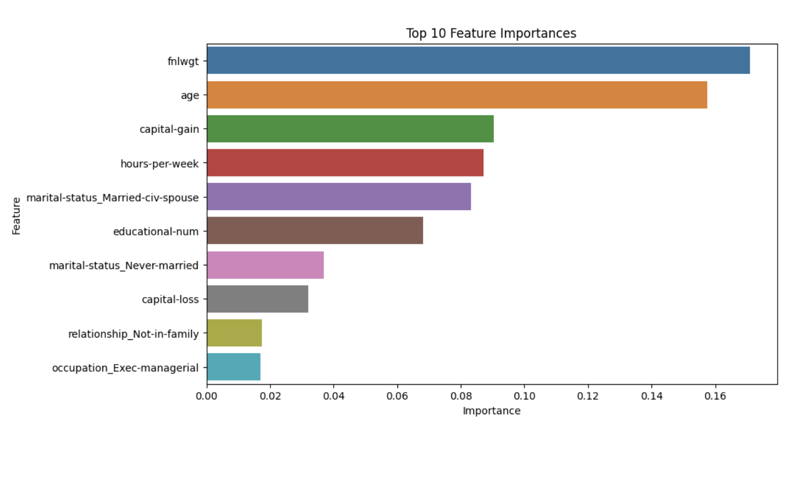
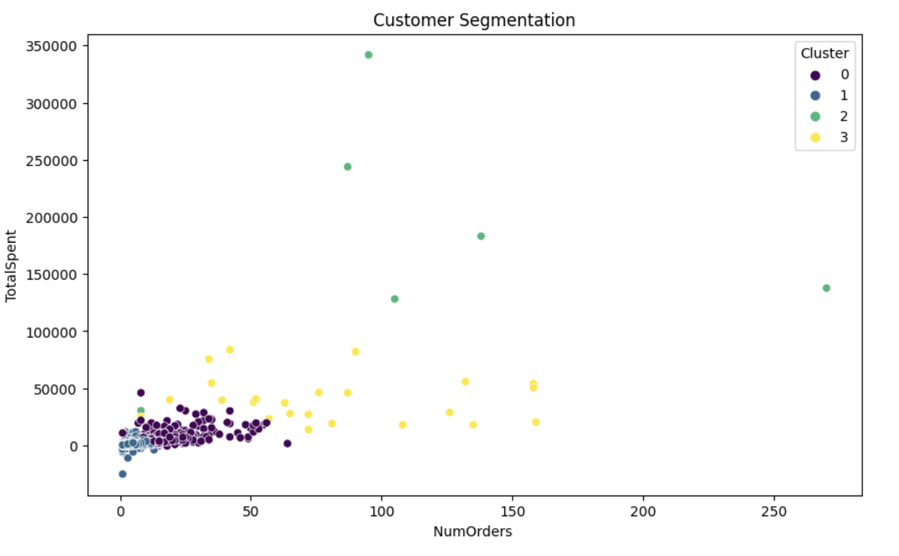
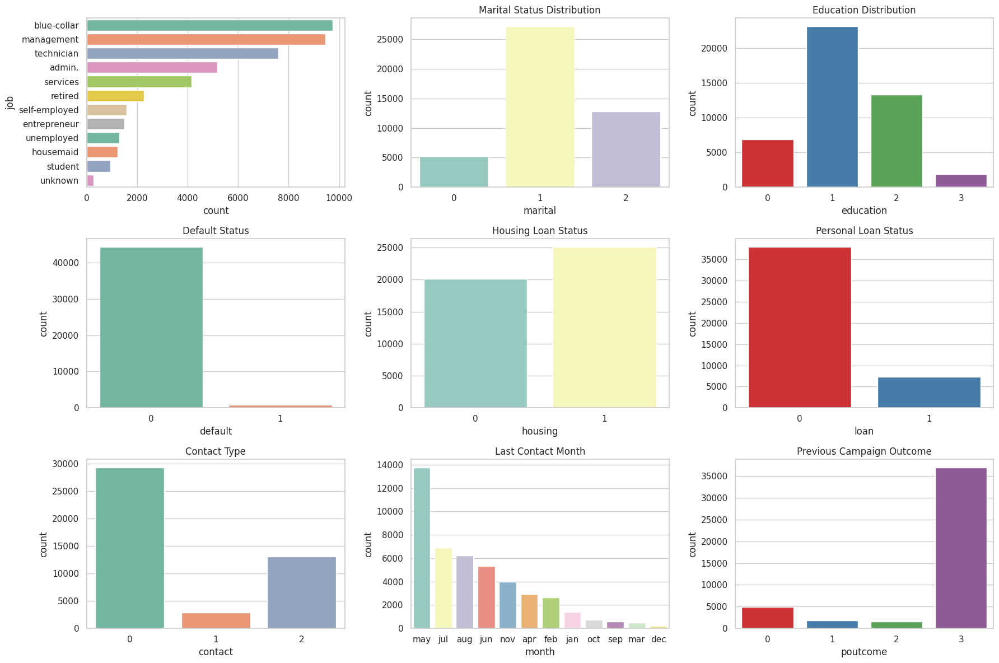
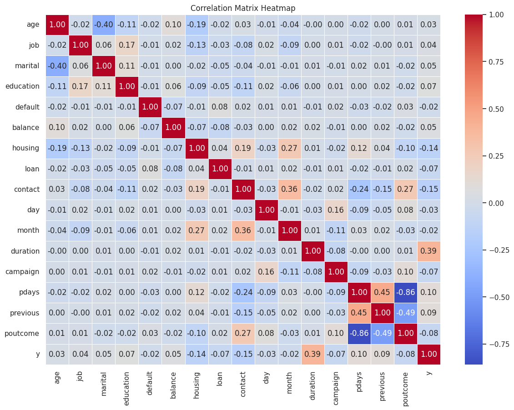
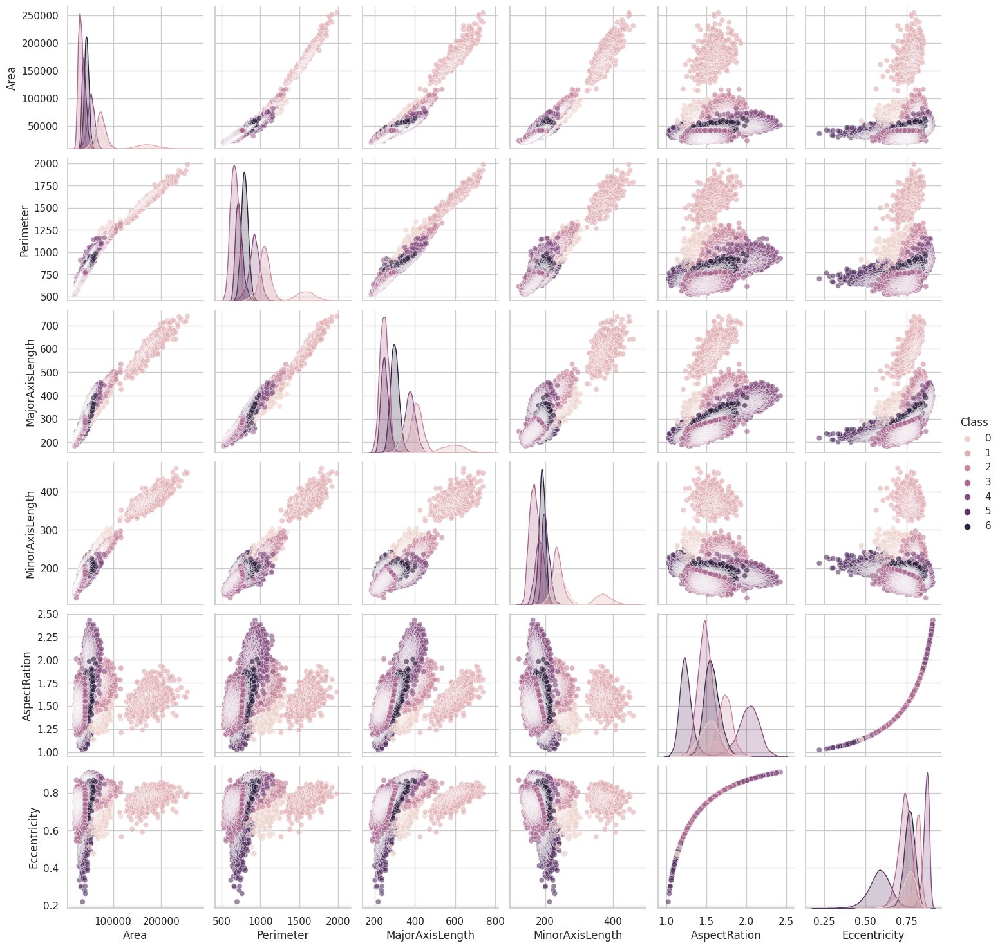
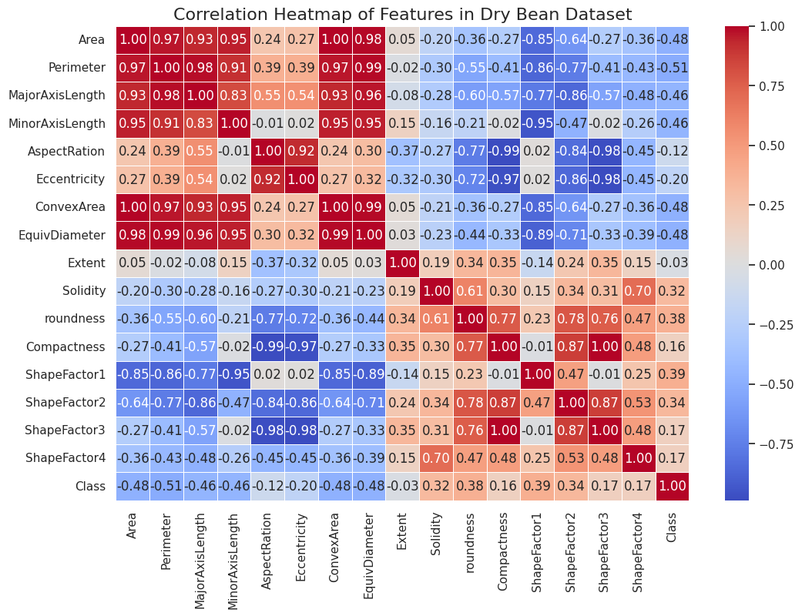
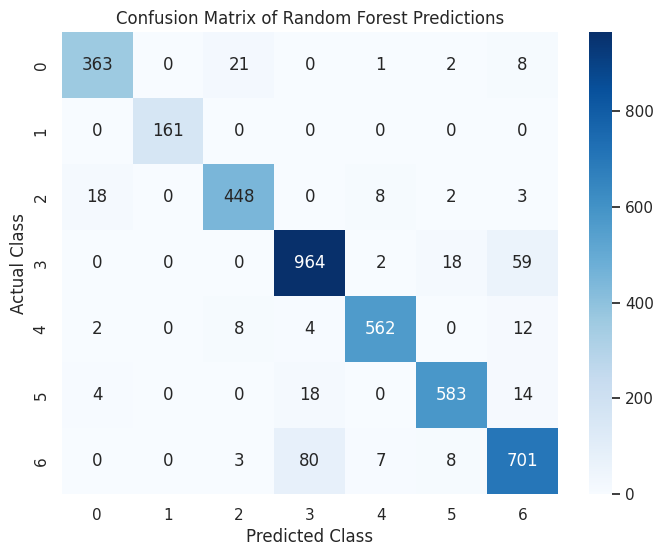

# 100 Days of Data Science


<p align="center">
  
  <!--  -->
</p>


Welcome to my **100 Days of Data Science** journey! 🚀

Over the following days, I'll be diving deep into data science, working on a variety of datasets, and exploring different topics within the field. Each time, I’ll be tackling new challenges, from data exploration and preprocessing to building and fine-tuning machine learning models. My goal is to document this journey and share my learnings, code, and insights with the community.

## What's Inside

- **Daily Projects**: Each time, you'll find a new project where I've applied data science techniques to solve a specific problem.
- **Code and Notebooks**: All my code and Jupyter notebooks will be available here, so you can follow along or use them as a reference.
- **Datasets**: Links to the datasets I’m using, along with a brief explanation of the problem statement and objectives.
- **Learning Resources**: I’ll also be sharing articles, tutorials, and resources that I found helpful along the way.


## How to Use This Repository

1. **Clone the Repository**: 
   ```bash
   git clone https://github.com/sushant097/100Days__DataScience.git
   ```
2. **Navigate Through the Folders**: Each day’s project will have its own folder with detailed explanations and code.
3. **Run the Notebooks**: If you want to try out the code yourself, simply open the notebooks and run them in your preferred environment. Also kaggle notebook link is provided in some cases. 


## Day 1: Women's E-Commerce Clothing Reviews

On the first day, I worked with the **Women's E-Commerce Clothing Reviews** dataset. I explored the data, handled preprocessing tasks, and built a machine learning model to predict product recommendations. You can find all the details and code for this project in the Day 1 folder.

* Github Implementation NotebooK: [Github Notebook](Implementation/Day1/transforming-review-data-into-features.ipynb)
* Kaggle Notebook: [Kaggle Notebook](https://www.kaggle.com/code/sushant097/transforming-review-data-into-features/)
* Dataset Link: [Dataset link](https://www.kaggle.com/datasets/nicapotato/womens-ecommerce-clothing-reviews)


## Day 2: Predict Adult Income

On Day 2, I worked with the Adult income dataset. I focused on exploring the data, performing preprocessing, and building a machine-learning model to predict adult income >50k or not.

Mainly worked with two models, logistic Regression and random Forest Classifier, are compared. The data seems imbalanced, so the random forest classifier improves the model's accuracy a bit. 

Learned and implemented :
* Data Encoding and feature scaling improves model performance. 
* Increase model complexity if the data is complex and accuracy is not improved with a simpler model. 
* Hyperparameter tuning methods like grid search improve the model accuracy as it finds the best parameters that work for the model for the given dataset.
* Visualized the feature importance of the model: Model interpretation.
* Search and listed other ways to improve model accuracy like SMOTE for data imbalance case, model class weight adjustment such that model can focus on minority class, Ensembling methods (like stacking, boosting) is another option.

* Github Implementation NotebooK: [Github Notebook](Implementation/Day1/transforming-review-data-into-features.ipynb)
* Kaggle Notebook: [Kaggle Notebook](https://www.kaggle.com/code/sushant097/day2-100daysofdatascience/)
* Dataset Link: [Dataset link](http://archive.ics.uci.edu/dataset/2/adult)




## Day3: Online Retail Customer Segmentation


🔍 **Explored Online Retail Data for Customer Segmentation Using Machine Learning**

- **Dataset Used**: Online Retail II (2009-2010), containing transactional data including Invoice, StockCode, CustomerID, Quantity, and Price.
  
- **Data Preparation**:
  - Loaded the dataset and performed initial exploration to understand its structure.
  - Cleaned the data by removing duplicates and handling missing values.
  - Conducted feature engineering to create relevant metrics like `TotalSpent`, `NumOrders`, and `TotalQuantity` for each customer.

- **Exploratory Data Analysis (EDA)**:
  - Visualized the distribution of key features like `TotalSpent` and explored relationships using scatter plots and pairplots.
  - Utilized Seaborn to create attractive and insightful visualizations.

- **Data Normalization**:
  - Applied standardization to ensure all features contributed equally in the clustering process.

- **Customer Segmentation with K-Means Clustering**:
  - Determined the optimal number of clusters using the Elbow Method.
  - Applied K-Means clustering to segment customers based on their purchasing behavior.
  - Visualized the customer segments and analyzed their characteristics.

- **Key Insights**:
  - Successfully segmented customers into distinct groups, each with unique purchasing patterns.
  - Identified potential target groups for personalized marketing strategies.


* Github Implementation NotebooK: [Github Notebook](Implementation/Day3/day3-online-retail-prediction.ipynb)
* Kaggle Notebook: [Kaggle Notebook](https://www.kaggle.com/code/sushant097/day3-online-retail-customer-segmentation/)
* Dataset Link: [Dataset link](http://archive.ics.uci.edu/dataset/352/online+retail)




## Day4: Bank marketing dataset to predict customer subscription behavior

🚀 On Day 4 I focused on a bank marketing dataset to predict customer subscription behavior. Here's what I accomplished:

🔍 Learned and implemented:

- 🧹 **Data Preprocessing:** Applied label encoding to handle categorical variables and standard scaling to normalize feature ranges.

- 📊 **Exploratory Data Analysis (EDA):** Conducted detailed univariate and bivariate analysis to uncover patterns and relationships in the data.

- 🤖 **Logistic Regression:** Built and interpreted a binary classification model to predict customer subscriptions, analyzing feature importance based on model coefficients.

- 🌳 **Random Forest Classifier:** Compared Logistic Regression with a Random Forest model, which provided better performance in identifying potential subscribers.

- 📈 **Feature Importance Visualization:** Visualized how different features contribute to the prediction, helping to understand the model's decision-making process.

💡 Takeaway:

- Combining simple models like Logistic Regression with more complex ones like Random Forest can offer valuable insights and improved accuracy in predictive tasks.

- Advanced data visualization techniques like univariate, bivariate, box plot, and pair plot help in understanding different attributes of the dataset, contributing to building a more robust machine learning model.

**Resources:**

* **[Notebook](./Implementation/Day%204/day4-predict-deposit-of-bank.ipynb)**

* **[Dataset](https://www.kaggle.com/datasets/sushant097/bank-marketing-dataset-full/data)**

<p align="center">
  
  
</p>


## Day 5 of 100 Days of Data Science Challenge

### 🚀 Dataset: Dry Bean Dataset

Today, I focused on classifying different types of beans based on geometric and shape-related features using machine learning. Below are the tasks I completed:

### 🔍 Steps Implemented:

- 🧹 **Data Preprocessing**: Removed redundant features by analyzing high correlations to prevent multicollinearity and improve model efficiency.
  
- 📊 **Exploratory Data Analysis (EDA)**: Conducted feature exploration using pair plots and a correlation heatmap to discover patterns and feature relationships.

- 🌳 **Random Forest Classifier**: Built a Random Forest classification model to predict the bean classes with an accuracy of **92.6%**.

- 📈 **Feature Importance Analysis**: Visualized the feature importance, identifying the most relevant features contributing to the prediction.

- 📉 **Confusion Matrix**: Generated a confusion matrix to evaluate model performance by examining correct and incorrect predictions for each class.

### 💡 Takeaway:

Removing redundant features and performing feature importance analysis significantly improved the Random Forest model’s accuracy. Visualization tools like heatmaps and pair plots were essential for understanding data patterns and enhancing model interpretation.

### Some Results:




**Resources:**
* **[Kaggle Notebook](https://www.kaggle.com/code/sushant097/day-5-dry-bean-dataset-analysis/)**
* **[Dataset](https://www.kaggle.com/datasets/muratkokludataset/dry-bean-dataset)**


