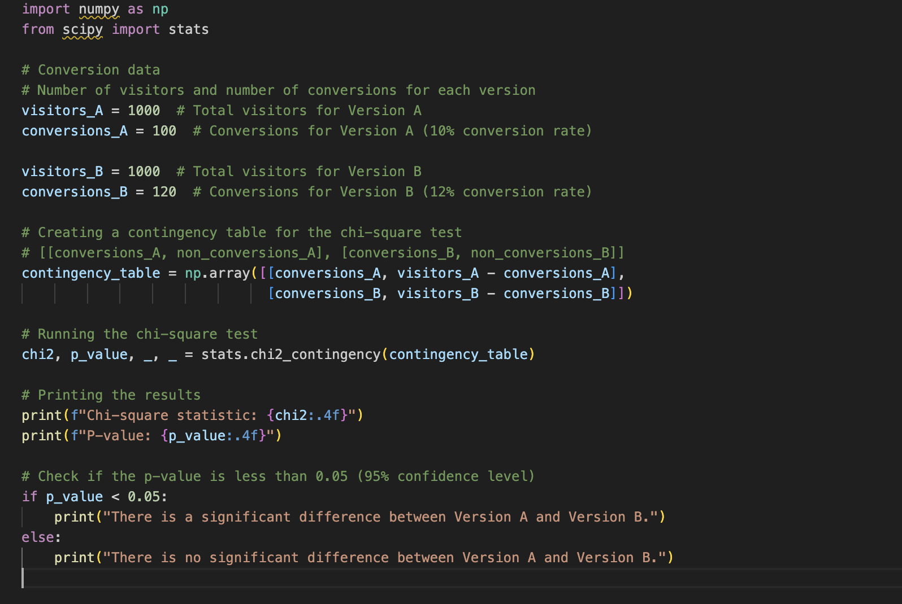

# 100 Days of Data Science


<p align="center">
  
  <!--  -->
</p>


# **Welcome to My 100 Days of Data Science Journey! 🚀**

Over the next 100 days, I'll be diving deep into data science, tackling real-world challenges, and sharing my progress with the community. Each day will focus on different aspects of data science, from foundational topics to advanced concepts like MLOps. My goal is to document this journey, share my learnings, and build a valuable resource for data enthusiasts.


## **What's Inside**

### **Daily Projects**
- Hands-on projects focused on solving real-world problems using data science techniques.
- From data exploration and preprocessing to building and fine-tuning machine learning models.

### **Key Topics Covered**
Here's an outline of the topics I plan to explore during this challenge:
- **Data Exploration and Visualization**: Understanding datasets, detecting patterns, and creating meaningful visualizations.
- **Feature Engineering**: Crafting features to improve model performance.
- **Machine Learning**: Building models for regression, classification, and clustering problems.
- **Deep Learning**: Working with neural networks for computer vision and NLP tasks.
- **Ensemble Learning**: Techniques like bagging, boosting, and stacking.
- **MLOps Concepts**: Deploying machine learning models with best practices, version control, and monitoring.
  - Model deployment using **Streamlit** and **FastAPI**.
  - Workflow orchestration with **Airflow**.
  - Experiment tracking with **MLflow**.
  - Containerization using **Docker**.
  - Automation with **GitHub Actions**.
- **Advanced Machine Learning Topics**: Hyperparameter tuning, transfer learning, and explainable AI.
- **Big Data and Scalability**: Using frameworks like Spark for large-scale data processing.
- **NLP and Computer Vision**: Applying state-of-the-art models to text and image datasets.


## **How to Use This Repository**
1. **Clone the Repository**:
   ```bash
   git clone https://github.com/sushant097/100Days__DataScience.git
   ```

2. **Navigate Through the Folders**:
   Each day's project will have its own folder, complete with:
   - A detailed explanation of the project.
   - The dataset used.
   - Relevant code and notebooks.

3. **Run the Notebooks**:
   Open the Jupyter Notebooks or check the provided Kaggle links to explore the projects and run the code yourself.


## **Why This Challenge?**
Data science is a vast field, and staying consistent is key to mastering it. Through this challenge, I aim to:
- Build a portfolio of practical projects.
- Learn and share best practices.
- Deepen my understanding of end-to-end machine learning workflows, including MLOps.


## **Learning Resources**
Along the way, I'll also share:
- Articles and tutorials that helped me learn new concepts.
- Links to insightful resources for data science and MLOps.


## **Daily Updates**
Follow my journey on [LinkedIn](https://www.linkedin.com/in/susan-gautam/) where I share daily progress and insights.


Feel free to suggest additional topics or share your thoughts on the projects. Let's learn and grow together! 🚀


------
------

## Day 1: Women's E-Commerce Clothing Reviews

On the first day, I worked with the **Women's E-Commerce Clothing Reviews** dataset. I explored the data, handled preprocessing tasks, and built a machine learning model to predict product recommendations. You can find all the details and code for this project in the Day 1 folder.

* Github Implementation NotebooK: [Github Notebook](Implementation/Day1/transforming-review-data-into-features.ipynb)
* Kaggle Notebook: [Kaggle Notebook](https://www.kaggle.com/code/sushant097/transforming-review-data-into-features/)
* Dataset Link: [Dataset link](https://www.kaggle.com/datasets/nicapotato/womens-ecommerce-clothing-reviews)


## Day 2: Predict Adult Income

On Day 2, I worked with the Adult income dataset. I focused on exploring the data, performing preprocessing, and building a machine-learning model to predict adult income >50k or not.

Mainly worked with two models, logistic Regression and random Forest Classifier, are compared. The data seems imbalanced, so the random forest classifier improves the model's accuracy a bit. 

Learned and implemented :
* Data Encoding and feature scaling improves model performance. 
* Increase model complexity if the data is complex and accuracy is not improved with a simpler model. 
* Hyperparameter tuning methods like grid search improve the model accuracy as it finds the best parameters that work for the model for the given dataset.
* Visualized the feature importance of the model: Model interpretation.
* Search and listed other ways to improve model accuracy like SMOTE for data imbalance case, model class weight adjustment such that model can focus on minority class, Ensembling methods (like stacking, boosting) is another option.

* Github Implementation NotebooK: [Github Notebook](Implementation/Day1/transforming-review-data-into-features.ipynb)
* Kaggle Notebook: [Kaggle Notebook](https://www.kaggle.com/code/sushant097/day2-100daysofdatascience/)
* Dataset Link: [Dataset link](http://archive.ics.uci.edu/dataset/2/adult)


## Day3: Online Retail Customer Segmentation


🔍 **Explored Online Retail Data for Customer Segmentation Using Machine Learning**

- **Dataset Used**: Online Retail II (2009-2010), containing transactional data including Invoice, StockCode, CustomerID, Quantity, and Price.
  
- **Data Preparation**:
  - Loaded the dataset and performed initial exploration to understand its structure.
  - Cleaned the data by removing duplicates and handling missing values.
  - Conducted feature engineering to create relevant metrics like `TotalSpent`, `NumOrders`, and `TotalQuantity` for each customer.

- **Exploratory Data Analysis (EDA)**:
  - Visualized the distribution of key features like `TotalSpent` and explored relationships using scatter plots and pairplots.
  - Utilized Seaborn to create attractive and insightful visualizations.

- **Data Normalization**:
  - Applied standardization to ensure all features contributed equally in the clustering process.

- **Customer Segmentation with K-Means Clustering**:
  - Determined the optimal number of clusters using the Elbow Method.
  - Applied K-Means clustering to segment customers based on their purchasing behavior.
  - Visualized the customer segments and analyzed their characteristics.

- **Key Insights**:
  - Successfully segmented customers into distinct groups, each with unique purchasing patterns.
  - Identified potential target groups for personalized marketing strategies.


* Github Implementation NotebooK: [Github Notebook](Implementation/Day3/day3-online-retail-prediction.ipynb)
* Kaggle Notebook: [Kaggle Notebook](https://www.kaggle.com/code/sushant097/day3-online-retail-customer-segmentation/)
* Dataset Link: [Dataset link](http://archive.ics.uci.edu/dataset/352/online+retail)


## Day4: Bank marketing dataset to predict customer subscription behavior

🚀 On Day 4 I focused on a bank marketing dataset to predict customer subscription behavior. Here's what I accomplished:

🔍 Learned and implemented:

- 🧹 **Data Preprocessing:** Applied label encoding to handle categorical variables and standard scaling to normalize feature ranges.

- 📊 **Exploratory Data Analysis (EDA):** Conducted detailed univariate and bivariate analysis to uncover patterns and relationships in the data.

- 🤖 **Logistic Regression:** Built and interpreted a binary classification model to predict customer subscriptions, analyzing feature importance based on model coefficients.

- 🌳 **Random Forest Classifier:** Compared Logistic Regression with a Random Forest model, which provided better performance in identifying potential subscribers.

- 📈 **Feature Importance Visualization:** Visualized how different features contribute to the prediction, helping to understand the model's decision-making process.

💡 Takeaway:

- Combining simple models like Logistic Regression with more complex ones like Random Forest can offer valuable insights and improved accuracy in predictive tasks.

- Advanced data visualization techniques like univariate, bivariate, box plot, and pair plot help in understanding different attributes of the dataset, contributing to building a more robust machine learning model.

**Resources:**

* **[Notebook](./Implementation/Day%204/day4-predict-deposit-of-bank.ipynb)**

* **[Dataset](https://www.kaggle.com/datasets/sushant097/bank-marketing-dataset-full/data)**

<p align="center">
  
  
</p>


## Day 5 of 100 Days of Data Science Challenge

### 🚀 Dataset: Dry Bean Dataset

Today, I focused on classifying different types of beans based on geometric and shape-related features using machine learning. Below are the tasks I completed:

### 🔍 Steps Implemented:

- 🧹 **Data Preprocessing**: Removed redundant features by analyzing high correlations to prevent multicollinearity and improve model efficiency.
  
- 📊 **Exploratory Data Analysis (EDA)**: Conducted feature exploration using pair plots and a correlation heatmap to discover patterns and feature relationships.

- 🌳 **Random Forest Classifier**: Built a Random Forest classification model to predict the bean classes with an accuracy of **92.6%**.

- 📈 **Feature Importance Analysis**: Visualized the feature importance, identifying the most relevant features contributing to the prediction.

- 📉 **Confusion Matrix**: Generated a confusion matrix to evaluate model performance by examining correct and incorrect predictions for each class.

### 💡 Takeaway:

Removing redundant features and performing feature importance analysis significantly improved the Random Forest model’s accuracy. Visualization tools like heatmaps and pair plots were essential for understanding data patterns and enhancing model interpretation.

### Some Results:


**Resources:**
* **[Kaggle Notebook](https://www.kaggle.com/code/sushant097/day-5-dry-bean-dataset-analysis/)**
* **[Dataset](https://www.kaggle.com/datasets/muratkokludataset/dry-bean-dataset)**


## Day 6 of 100 Days of Data Science Challenge

### Tackling Overfitting in Machine Learning


**What is Overfitting?**  
Overfitting happens when a model performs exceptionally well on the training data but struggles with new, unseen data. Essentially, the model becomes too complex and starts capturing noise and outliers instead of the true underlying patterns. In other words, it "memorizes" the data rather than learning from it.

**How can we reduce Overfitting?**  
Here are a few techniques to prevent overfitting:
- **Regularization:** This adds a penalty to the complexity of the model. Two popular types are L1 (Lasso) and L2 (Ridge) regularization. They help by constraining or shrinking the coefficient values, which reduces the model's complexity.
- **Cross-validation:** Using techniques like k-fold cross-validation ensures that the model is evaluated on different portions of the data, making it more robust.
- **Simpler models:** Choosing simpler models with fewer parameters can reduce the chances of overfitting.
- **Early stopping:** This involves stopping the training process before the model starts overfitting the training data.
- **Data augmentation:** In cases like image classification, artificially increasing the size of the training data by applying transformations like rotation or flipping can help the model generalize better.

Learning to prevent overfitting is essential for building models that not only perform well on training data but also on new data. 

## Day 7 of 100 Days of Data Science Challenge

### Understanding the Bias-Variance Tradeoff in Machine Learning


The **bias-variance tradeoff** is a crucial concept in machine learning that helps us understand the performance of our models in terms of prediction error. This tradeoff occurs when balancing two sources of error:

- **Bias**: The error caused by a model that is too simple and cannot capture the underlying patterns in the data. High bias leads to **underfitting**, where the model performs poorly on both the training data and new, unseen data.

- **Variance**: The error caused by a model that is too complex and overly sensitive to the training data. High variance leads to **overfitting**, where the model fits even the noise in the data, resulting in poor performance on new data.

### Key Concept:
- **Underfitting**: When the model has high bias and cannot capture the relationships in the data.
- **Overfitting**: When the model has high variance and fits the training data too closely, including noise.

The goal in machine learning is to **minimize the total error** by finding a balance between bias and variance, i.e., creating a model that generalizes well to new, unseen data.

### Visualizing the Bias-Variance Tradeoff:


In the above graph:
- As **model complexity** increases, **bias** decreases, but **variance** increases.
- The **total error** (black curve) is the sum of errors from bias and variance, and the optimal model complexity is where the total error is minimized.

### How to Handle the Bias-Variance Tradeoff:
- **Increase complexity** to reduce bias (e.g., using a more powerful model).
- **Reduce complexity** to decrease variance (e.g., using regularization techniques).
- Use techniques like **cross-validation** to ensure the model generalizes well.

This tradeoff is key to building a model that neither underfits nor overfits and performs well on both the training data and unseen data.


## Day 8 of 100 Days of Data Science: Handling Data Imbalance


When we're working with datasets, we'll often come across situations where one class has many more samples than the other(s). This is called **data imbalance**. For example, in a dataset of credit card transactions, there may be 95% legitimate transactions and only 5% fraudulent ones. A model trained on this data might simply predict "legitimate" every time and achieve high accuracy, but it would fail to catch fraud, which is the most important outcome.

Here’s how we can handle it:

### 1. **Resampling the Dataset**
   - **Oversampling**: Add more examples of the minority class by duplicating or creating synthetic examples (using techniques like SMOTE).
   - **Undersampling**: Reduce the majority class by removing some examples.

### 2. **Using Different Metrics**
   - Instead of using accuracy, we should look at metrics like:
     - **Precision**: How many of the predicted positives are correct.
     - **Recall**: How many actual positives were identified.
     - **F1-Score**: Harmonic mean of precision and recall.
     - **AUC-ROC**: Area under the curve that shows how well the model distinguishes between classes.

### 3. **Modifying Algorithms**
   - **Cost-sensitive learning**: Adjust the algorithm so that it penalizes the model more for getting the minority class wrong. This makes the model pay more attention to the minority class.

### 4. **Using Ensemble Methods**
   - Models like **Random Forest** or **Gradient Boosting** can combine multiple decision trees, making them more robust to imbalanced data.

---

Here’s a simple  code to demonstrate each technique:


### Detailed Comments:

1. **Data generation**: We generate a synthetic dataset where 90% of the data belongs to the majority class, and only 10% belongs to the minority class.
2. **Train-test split**: We divide the dataset into training and test sets.
3. **Base model**: We train a RandomForest classifier on the imbalanced dataset to show how a model performs without handling imbalance.
4. **SMOTE**: We apply SMOTE, an oversampling technique, to balance the classes by generating synthetic data for the minority class.
5. **Undersampling**: We undersample the majority class by randomly selecting a subset of examples equal to the number of minority class examples. This ensures that both classes are equally represented.


## Day 9 of 100 Days of Data Science: 𝐀/𝐁 𝐓𝐞𝐬𝐭𝐢𝐧𝐠 – 𝐓𝐡𝐞 𝐊𝐞𝐲 𝐭𝐨 𝐃𝐚𝐭𝐚-𝐃𝐫𝐢𝐯𝐞𝐧 𝐃𝐞𝐜𝐢𝐬𝐢𝐨𝐧𝐬 🔍📊


### **What is A/B Testing?**

A/B testing is basically a way to compare two different versions of something—like a website, email, or product feature—to figure out which one works better. It’s like running a mini-experiment, where you show one version (Version A) to half of your audience and a second version (Version B) to the other half, then see which version gets better results.

### **An Everyday Example:**
Imagine you run an **online store**. You want to sell more items, so you're trying to figure out which “Buy Now” button works better. You have two different designs:
- **Version A**: A red button with the text “Buy Now.”
- **Version B**: A green button with the text “Shop Now.”

You don’t want to just guess which button will get more people to make a purchase, so you decide to test it out using A/B testing.

### **How to Run an A/B Test:**

1. **Split Your Audience**:  
   First, you divide your website visitors into two random groups. One group (Group 1) will see **Version A** with the red button, and the other group (Group 2) will see **Version B** with the green button. This way, each group gets a different experience, but everything else about the website stays the same.

2. **Track What Happens**:  
   Let the test run for some time, like a week. During this time, you track how many people from each group actually click the button and buy something.
   - **Group 1 (Red Button)**: Out of 1000 people, 100 make a purchase (which means a **10% conversion rate**).
   - **Group 2 (Green Button)**: Out of 1000 people, 120 make a purchase (which means a **12% conversion rate**).

   So it looks like the green button (Version B) is doing better since more people clicked and bought something. But we need to be sure this difference didn’t happen by chance.

3. **Is the Difference Real or Just Luck?**  
   To know for sure if the green button is better, we need to check if the results are **statistically significant**. This means we want to see if the difference in conversion rates is big enough to confidently say it’s because of the button and not just random luck. This is where we use something called a **p-value**. 

4. **Check for Statistical Significance**:  
   The **p-value** helps you figure out if the difference between the red and green button is real or just a coincidence. If the p-value is less than 0.05, it means there's only a 5% chance the difference happened randomly. In this case, if the p-value is below 0.05, we can confidently say that **Version B (green button)** really is better.

5. **Make Your Decision**:  
   If the test shows that the green button is truly better, you can now make it the default for everyone who visits your website. You know from the test that this change will likely lead to more purchases!

### **Breaking Down Some Key Terms:**

- **Conversion Rate**: The percentage of visitors who complete the action you want, like making a purchase. In our example, it was 10% for the red button and 12% for the green button.
- **Control Group (A)**: This is the group that sees the original version of the button (red in this case).
- **Test Group (B)**: This group sees the new version (green button).
- **Statistical Significance**: This is a way to measure if the difference between the two groups is real and not just due to chance.
- **p-value**: A number that tells you how likely it is that the difference happened by random chance. If it’s less than 0.05, you can be pretty confident that the difference is meaningful.

### **Why A/B Testing Matters:**

A/B testing helps you make decisions based on **data**, not just guesses or instincts. Instead of assuming what will work better, you test it with real users and see the results for yourself. This means your decisions are backed by facts, and you’re more likely to make improvements that actually matter.

### Code Example:



## Day 10 of 100 Days of Data Science: Implement Linear Regression algorithm from scratch 


In linear regression, the goal is to model the relationship between the input features $(X)$ and the target variable $(y)$ by fitting a linear equation to the observed data. The model can be expressed as:

$$
y = X \theta
$$

Where:
- $(X)$ is the matrix of input features (including the bias term).
- $(\theta)$ is the vector of parameters (coefficients), which includes the bias term and the feature coefficients.
- $(y)$ is the vector of target values (the outputs we want to predict).

### Normal Equation

The Normal Equation provides a closed-form solution to compute the optimal parameters $(\theta)$ that minimize the cost function (Mean Squared Error). The cost function is defined as:

$$
J(\theta) = \frac{1}{2m} \sum_{i=1}^{m} (h_{\theta}(x^{(i)}) - y^{(i)})^2
$$

Where:
- $(m)$ is the number of training examples.
- $(h_{\theta}(x^{(i)}))$ is the predicted value for the $(i)$-th training example.
- $(y^{(i)})$ is the actual value for the $(i)$-th training example.

To minimize this cost function, we use the Normal Equation:

$$
\theta = (X^T X)^{-1} X^T y
$$

Where:
- $(X^T)$ is the transpose of the feature matrix $(X)$.
- $((X^T X)^{-1})$ is the inverse of the product of $(X^T)$ and $(X)$.
- $(y)$ is the target variable vector.


$$
RMSE = \sqrt{\frac{1}{m} \sum_{i=1}^{m} (y^{(i)} - \hat{y}^{(i)})^2}
$$

Where:
- $(y^{(i)})$ is the actual value for the $(i)$-th training example.
- $(\hat{y}^{(i)})$ is the predicted value for the $(i)$-th training example.
- $(m)$ is the number of data points.

The Root Mean Squared Error (RMSE) gives us an idea of how well the model fits the training data. A lower RMSE indicates a better fit of the model.


#### Gradient Descent (Alternative Approach):
While the Normal Equation provides a direct solution, you can also solve linear regression using **Gradient Descent**. However, this approach is iterative and requires careful tuning of hyperparameters such as the learning rate and number of iterations.

In Gradient Descent, the idea is to iteratively update the model parameters $(\theta)$ to minimize the cost function (Mean Squared Error in our case). The cost function is:

$$
J(\theta) = \frac{1}{2m} \sum_{i=1}^{m} \left( h_{\theta}(x^{(i)}) - y^{(i)} \right)^2
$$

Where:
- $(m)$ is the number of training examples.
- $h_{\theta}(x^{(i)})$ = $\theta_0$ + $\theta_1 x^{(i)}$ is the hypothesis (predicted value).

The gradient of the cost function with respect to $(\theta)$ is:

$$
\frac{\partial J(\theta)}{\partial \theta_j} = \frac{1}{m} \sum_{i=1}^{m} \left( h_{\theta}(x^{(i)}) - y^{(i)} \right) x_j^{(i)}
$$

This gradient tells us the direction and magnitude to adjust $(\theta)$ to reduce the cost. We update $(\theta)$ as:

$$
\theta := \theta - \alpha \frac{1}{m} \sum_{i=1}^{m} \left( h_{\theta}(x^{(i)}) - y^{(i)} \right) x_j^{(i)}
$$

Where $(\alpha)$ is the learning rate that controls how big the steps are during the update.


The code for this is:


#### Explanation of Code:
1. **Normal Equation**:
   - We first compute $(\theta)$ using the closed-form solution with the Normal Equation.
   - The predicted values and RMSE are calculated and printed.

2. **Gradient Descent**:
   - A function `gradient_descent` is implemented. It iteratively updates $(\theta)$ using the gradient of the cost function.
   - After running for `n_iterations`, the final $(\theta)$ values are obtained.
   - Predictions are made using the learned $(\theta)$, and RMSE is computed and printed.

### Mathematical Explanation:

- **Cost Function**:  
  In linear regression, the cost function (Mean Squared Error) is minimized to find the best-fitting line. The cost function is:

$$
  J(\theta) = \frac{1}{2m} \sum_{i=1}^{m} \left( h_{\theta}(x^{(i)}) - y^{(i)} \right)^2
$$

  Where:
  - $h_{\theta}(x^{(i)})$ = $theta_0$ + $theta_1 x^{(i)}$ is the prediction.
  - $m$ is the number of training examples.

- **Gradient Descent Update Rule**:
  To minimize the cost function, we update $\theta$ using the following rule:

$$
  \theta := \theta - \alpha \cdot \frac{1}{m} \sum_{i=1}^{m} \left( h_{\theta}(x^{(i)}) - y^{(i)} \right) x_j^{(i)}
$$

  This rule is applied repeatedly (for a fixed number of iterations) to get the optimal $(\theta)$.

#### Output:

The output will show the estimated coefficients and RMSE for both the **Normal Equation** and **Gradient Descent** methods.

For example:
```
Estimated coefficients using Normal Equation (theta): [[4.21509616]
                                                       [2.77011339]]
RMSE on the training set (Normal Equation): 0.8981005311027566

Estimated coefficients using Gradient Descent (theta): [[4.2075467 ]
                                                        [2.80339251]]
RMSE on the training set (Gradient Descent): 0.8983479400556326
```

#### Conclusion:

- **Normal Equation**: Provides an exact solution to linear regression by solving the equation $\theta$ = $(X^T X)^{-1} X^T y$. It works well for small to medium datasets but can be computationally expensive for very large datasets.
  
- **Gradient Descent**: Iteratively finds the solution by updating $(\theta)$ in the direction of the negative gradient. It's more scalable for large datasets but requires careful tuning of the learning rate and number of iterations.

Both methods yield similar results, with slight differences due to the iterative nature of gradient descent.


## Day 11 100 Days of Data Science: What Do Eigenvalues and Eigenvectors Mean in PCA?


In Principal Component Analysis (PCA), **eigenvalues** and **eigenvectors** are core mathematical concepts used to reduce the dimensionality of data while preserving the most significant features or patterns.


- **Eigenvectors** are directions in which data is stretched or compressed during a linear transformation. In the context of PCA, they represent the directions (or axes) of the new feature space.
- **Eigenvalues** correspond to the magnitude of the stretching or compressing along those directions. They tell us how much variance (or information) is captured along each eigenvector.

### **PCA and Covariance Matrix**

PCA starts with the **covariance matrix** of your data, which summarizes the relationship between variables (features) in your dataset. If you have a dataset with $n$ features, the covariance matrix is an $n \times n$ matrix. The goal of PCA is to find the principal components, which are the eigenvectors of this covariance matrix, and the corresponding eigenvalues.

### **Step-by-Step Process of PCA:**

1. **Standardize the Data**: 
   PCA is affected by the scale of the data, so you start by standardizing your data (mean = 0, variance = 1 for each feature).
   
2. **Compute the Covariance Matrix**: 
   From the standardized data, compute the covariance matrix $C$, which is:
   $C = \frac{1}{n-1} X^T X$
   where $X$ is the matrix of your standardized data.

3. **Find Eigenvalues and Eigenvectors**: 
   Next, we solve the following equation for eigenvalues $ \lambda $ and eigenvectors $v$:
   $C v$ = $\lambda v$
   Here, $v$ is the eigenvector (a direction in the feature space), and $ \lambda $ is the eigenvalue (the variance captured by that direction). This equation is essentially saying that when the covariance matrix $C$ is applied to an eigenvector $v$, the result is a scaled version of $v$, scaled by $\lambda$.

4. **Select Principal Components**: 
   - Sort the eigenvalues in descending order. The eigenvectors corresponding to the largest eigenvalues are the principal components, as they capture the most variance.
   - The number of eigenvectors (principal components) you choose depends on how much variance you want to retain in your data. Typically, you choose enough eigenvectors to explain 90%–95% of the variance.

### **Equation for PCA in Terms of Eigenvalues and Eigenvectors**:

The transformation of the original data $ \mathbf{X} $ into the principal component space is given by:
$
\mathbf{Z} = \mathbf{X} \mathbf{V}
$
Where:
- $ \mathbf{Z} $ is the matrix of transformed data (in terms of principal components).
- $ \mathbf{V} $ is the matrix of eigenvectors (principal components) that were chosen based on their corresponding eigenvalues.
- $ \mathbf{X} $ is the original data.

### **Application in PCA**:
- **Dimensionality Reduction**: PCA helps in reducing the number of features (dimensions) by projecting the data onto the new axes (principal components) defined by the eigenvectors, while preserving the most important information (variance) captured by the eigenvalues.
  
- **Data Compression**: By retaining only the principal components with the largest eigenvalues, you can compress your data while losing minimal information.

- **Visualization**: PCA allows for easier visualization of high-dimensional data by reducing it to 2 or 3 dimensions (using the top 2 or 3 eigenvectors).

### **Real-World Example**:

Imagine you have a dataset of customer preferences for different products with 100 features. Analyzing all 100 features might be too complex and unnecessary. PCA reduces the dataset to a smaller number of features (e.g., 10), which still captures most of the patterns in customer behavior. The new axes (eigenvectors) represent combinations of original features, and the corresponding eigenvalues tell you how much information each new axis retains.

### Simple code for visualization:

```python
import numpy as np
import matplotlib.pyplot as plt
from sklearn.decomposition import PCA
from sklearn.datasets import make_blobs

# Generate synthetic 2D data (4 clusters, 2 features)
X, _ = make_blobs(n_samples=100, n_features=2, centers=4, random_state=42)

# Perform PCA
pca = PCA(n_components=2)
X_pca = pca.fit_transform(X)

# Get the eigenvectors and eigenvalues
eigenvectors = pca.components_
eigenvalues = pca.explained_variance_

# Recalculate eigenvector scaling to be more realistic using square root of eigenvalues
eigenvalues_sqrt = np.sqrt(eigenvalues)
# Plot the original data and the eigenvectors with more realistic scaling (without dashed lines)
plt.figure(figsize=(8, 6))
plt.scatter(X[:, 0], X[:, 1], alpha=0.6, label='Original Data')
origin = np.mean(X, axis=0)

# Plot eigenvectors in both positive and negative directions with realistic scaling
for i in range(2):
    # Positive direction
    plt.quiver(*origin, *eigenvectors[i] * eigenvalues_sqrt[i], 
               angles='xy', scale_units='xy', scale=1, color=f'C{i}', label=f'Eigenvector {i+1} (positive)')
    # Negative direction
    plt.quiver(*origin, *-eigenvectors[i] * eigenvalues_sqrt[i], 
               angles='xy', scale_units='xy', scale=1, color=f'C{i}', alpha=0.6)

# Labels and legend
plt.axhline(0, color='grey', linestyle='--', linewidth=0.5)
plt.axvline(0, color='grey', linestyle='--', linewidth=0.5)
plt.title('PCA: Data with Eigenvectors (More Realistic)')
plt.xlabel('Feature 1')
plt.ylabel('Feature 2')
plt.legend()
plt.grid(True)

plt.show()

```
#### Output:


Here is a visual representation of PCA and its eigenvectors. The scatter plot shows the original 2D data, while the arrows represent the eigenvectors (principal components), scaled by their corresponding eigenvalues. The directions of the arrows indicate the new axes (principal components), and their lengths correspond to how much variance (information) each component captures.

Eigenvector 1 (longer arrow) captures more variance compared to Eigenvector 2, demonstrating that the data is more spread out in that direction. This visual helps explain how PCA transforms the data into a new space based on the directions of maximum .

## Day 12 : Data Analysis on Iris Dataset using R

I analyzed the Iris dataset and wrote the **Story: Uncovering Patterns in the Iris Dataset**.

Some of the visualization I got: 


You can see the implementation notebook over [here](Implementation/Day12/data-analyis-iris-dataset-in-r.ipynb).

If you want to run it directly in Kaggle. [Visit here.](https://www.kaggle.com/code/sushant097/data-analyis-iris-dataset-in-r/notebook?scriptVersionId=201587423)


## Day 13: Exploring the H1B Landscape: Key Insights from 2015-2019 in R

I analyzed the H1B Dataset and got different interesting insights!. 

Some of the visualization I got: 


You can see the implementation notebook over [here](Implementation/Day13/h1b-data-analysis-in-r.ipynb).

If you want to run it directly in Kaggle. [Visit here.](https://www.kaggle.com/code/sushant097/h1b-data-analysis-in-r/notebook)

## Day 14: Gradient Descent of Logistic regression


Today I learn about derivation of gradient descent parameters for logistic regression. Here is popular interview question: 

 **[Difficult] Can You Explain Logistic Regression and Derive Gradient Descent for Logistic Regression?**

**Logistic Regression** is a statistical model used for binary classification tasks. It predicts the probability that a given input belongs to a particular class. The model uses the logistic function (or sigmoid function) to convert the linear combination of input features into a probability.

**Logistic Function**:

$[ \sigma(z) = \frac{1}{1 + e^{-z}} ]$

Where $( z = \mathbf{w}^\top \mathbf{x} + b )$ (linear combination of weights and features).

The **loss function** used in logistic regression is the **cross-entropy loss**:
$L(\mathbf{w}, b) = - \frac{1}{N} \sum_{i=1}^{N} \left[ y_i \log(\hat{y}_i) + (1 - y_i) \log(1 - \hat{y}_i) \right]$

Where $( y_i )$ is the true label, $( \hat{y}_i )$ is the predicted probability, and $( N )$ is the number of training samples.

**The Loss Function: Cross-Entropy Loss:**

Logistic regression uses cross-entropy loss (also known as log loss) as its loss function. This measures the difference between the predicted probability y' and the actual label y for each training sample. The goal of gradient descent is to minimize the loss function. The negative sign ensures that the cross-entropy loss yields positive values, creating a function that is minimized when predictions align with true labels. Thus, with the negative sign, the model’s goal becomes to lower the error, leading to more accurate predictions.

**Gradient Descent for Logistic Regression**:
To update the model parameters, we compute the gradient of the loss function with respect to the weights and biases:


<!-- $\frac{\partial L}{\partial w_j}$ = $\frac{1}{N}$ $\sum_{i=1}^{N}$ $(\hat{y}_i - y_i)$ *  $x_{ij}$  -->

After solving couple of equations we get,

$\frac{\partial L}{\partial w_ij} = \frac{1}{N} \sum_{i=1}^{N} (\hat{y}_i - y_i) * x_ij$ 

$\frac{\partial L}{\partial b} = \frac{1}{N} \sum_{i=1}^{N} (\hat{y}_i - y_i)$

These gradients are then used to update the weights and biases iteratively:

$w_j = w_j - \eta \frac{\partial L}{\partial w_j}$

$b = b - \eta \frac{\partial L}{\partial b}$

Where $\eta$ is the learning rate.


## Day 15: Different Types of Activation Functions 


Activation functions are crucial components in neural networks, introducing non-linearity into the model, which allows the network to learn complex patterns. Here are the common types of activation functions:

1. **Sigmoid Activation Function**
   - **Equation**: $\sigma(x) = \frac{1}{1 + e^{-x}}$
   - **Range**: (0, 1)
   - **Characteristics**: The sigmoid function maps input values to a range between 0 and 1, making it useful for binary classification. However, it tends to suffer from the **vanishing gradient problem**, especially for very high or very low input values, where the gradient becomes very small, slowing down learning.

2. **Tanh (Hyperbolic Tangent) Activation Function**
   - **Equation**: $\text{tanh}(x) = \frac{e^x - e^{-x}}{e^x + e^{-x}}$
   - **Range**: (-1, 1)
   - **Characteristics**: The tanh function is similar to the sigmoid but is zero-centered, meaning the outputs are in the range of -1 to 1. This can make optimization easier, but it still suffers from the vanishing gradient problem in a similar way to the sigmoid function.

3. **ReLU (Rectified Linear Unit) Activation Function**
   - **Equation**: $\text{ReLU}(x) = \max(0, x)$
   - **Range**: $[0, ∞)$
   - **Characteristics**: ReLU is the most commonly used activation function in deep learning models. It outputs the input directly if it is positive; otherwise, it outputs zero. ReLU mitigates the vanishing gradient problem but can lead to **dying ReLU** where neurons stop activating (outputting zero) across all inputs, which can cause some parts of the network to essentially "die."

4. **Leaky ReLU Activation Function**
   - **Equation**: $\text{Leaky ReLU}(x) = \max(\alpha x, x)$ (where $( \alpha )$ is a small positive value, usually 0.01)
   - **Range**: $(-∞, ∞)$
   - **Characteristics**: Leaky ReLU is a variation of ReLU where, instead of outputting zero for negative inputs, it outputs a small, non-zero value (controlled by $( \alpha )$. This helps prevent the dying ReLU problem and ensures that all neurons continue to learn.

5. **Softmax Activation Function**
   - **Equation**: $\text{Softmax}(x_i) = \frac{e^{x_i}}{\sum_{j=1}^{n} e^{x_j}}$
   - **Range**: (0, 1) for each output, and the sum of all outputs is 1.
   - **Characteristics**: Softmax is used in the output layer for multi-class classification problems. It converts logits (raw model outputs) into probabilities, with each output representing the probability of a class.

6. **ELU (Exponential Linear Unit) Activation Function**
   - **Equation**:
   


   - **Range**: (-α, ∞) where α is a constant.
   - **Characteristics**: ELU is similar to ReLU but tends to push mean unit activations closer to zero, which speeds up learning. The exponential component allows the function to output negative values, reducing the bias shift during training.

7. **Swish Activation Function**
   - **Equation**: $\text{Swish}(x) = x \cdot \sigma(x)$
   - **Range**: $(-∞, ∞)$
   - **Characteristics**: Swish is a smooth, non-monotonic function that has been shown to outperform ReLU on deeper models. Unlike ReLU, it allows for negative inputs and has a non-zero gradient for all inputs.


Different activation functions plot:


### The Vanishing Gradient Problem

The **vanishing gradient problem** is a major issue that occurs during the training of deep neural networks, especially when using activation functions like Sigmoid and Tanh. The problem arises because, in these functions, the gradients can become extremely small as the input moves towards the saturated regions of the curve (either very high or very low values). This causes the gradient descent updates to become negligible, effectively stalling the learning process for earlier layers in the network.

#### **Why It Happens:**
1. **Sigmoid and Tanh Functions**: Both functions squash the input into a small range, leading to very small gradients for inputs that are far from the origin. For example, in the case of the sigmoid function, when the input $x$ is large and positive or large and negative, the gradient $ \sigma(x) \cdot (1 - \sigma(x))$ becomes very close to zero.
  
2. **Layer-Wise Gradient Multiplication**: In backpropagation, the gradients are propagated backward through the network. If the gradients are small in the early layers (near the input), the multiplication of small gradients across many layers leads to an exponentially smaller gradient by the time it reaches the initial layers. This makes it very difficult for these layers to learn, leading to a network that only updates its weights significantly in the last few layers, effectively hindering the model's ability to learn complex patterns.

#### **How to Mitigate It:**
1. **Use of ReLU and its Variants**: ReLU and its variants like Leaky ReLU help alleviate the vanishing gradient problem by having a gradient of 1 for positive inputs, ensuring that the gradient does not vanish as it propagates through the network.
  
2. **Batch Normalization**: This technique normalizes the inputs to each layer, ensuring that they have a consistent scale, which can reduce the likelihood of the gradients vanishing.
  
3. **Gradient Clipping**: This technique involves setting a threshold for the gradients during backpropagation. If the gradient exceeds this threshold, it is clipped to the maximum value, preventing it from becoming too small or too large.

4. **Use of Advanced Optimizers**: Optimizers like Adam or RMSprop, which adapt learning rates during training, can also help in addressing the vanishing gradient problem by adjusting the step sizes based on the gradient’s history.

Understanding and addressing the vanishing gradient problem is crucial for successfully training deep neural networks, allowing them to learn efficiently across all layers.


## Day 16:  Different Types of Optimizers — How is Adam Optimizer Different from RMSprop?

Optimizers play a critical role in training neural networks. They adjust the model parameters iteratively to minimize the loss function. Let’s explore some commonly used optimizers and analyze the visual representation in the uploaded image.


### **Common Optimizers**
#### 1. **Gradient Descent (GD)**
   - **Overview**: Updates parameters using the entire dataset to calculate gradients.
   - **Strength**: Provides a global view of the loss landscape.
   - **Weakness**: Computationally expensive and slow convergence, especially for large datasets.

#### 2. **Stochastic Gradient Descent (SGD)**
   - **Overview**: Updates parameters using a single data sample at a time.
   - **Strength**: Faster updates and computationally efficient.
   - **Weakness**: Highly noisy updates can cause the optimization path to fluctuate, leading to slower convergence.

#### 3. **Momentum**
   - **Overview**: Adds a fraction of the previous update (momentum term) to the current update, smoothing the optimization path.
   - **Strength**: Reduces oscillations and accelerates convergence in the relevant direction.
   - **Weakness**: May overshoot the optimal point if not properly tuned.

#### 4. **RMSprop (Root Mean Square Propagation)**
   - **Overview**: Scales the learning rate for each parameter by the exponentially decaying average of squared gradients.
   - **Strength**: Adapts learning rates, prevents vanishing gradients, and is effective in non-stationary settings.
   - **Weakness**: Only considers the second moment, which may lead to biased updates in some scenarios.

#### 5. **Adam (Adaptive Moment Estimation)**
   - **Overview**: Combines the benefits of Momentum and RMSprop by considering both the first moment (mean) and second moment (variance) of gradients.
   - **Strength**: Robust and adaptive, making it highly effective for deep learning models.
   - **Weakness**: Requires more hyperparameter tuning compared to RMSprop.


### **Adam vs. RMSprop**
| Feature               | RMSprop                         | Adam                            |
|-----------------------|---------------------------------|---------------------------------|
| **Learning Rate**     | Adjusts based on squared gradients | Adjusts based on mean and variance of gradients |
| **Update Strategy**   | Uses only the second moment     | Combines first and second moments |
| **Convergence**       | Stable                         | Faster and robust |
| **Strengths**         | Handles non-stationary gradients well | Effective in noisy and sparse gradients |
| **Weaknesses**        | Limited by using only one moment | Slightly more computationally expensive |


**Different optimizers visualization:**


### **Explanation of the Figure**
The above visualization illustrates how different optimizers traverse the loss surface to reach the global minimum. Here’s a breakdown of each optimizer’s trajectory:

1. **SGD (Red)**:
   - Displays zig-zagging behavior due to noisy gradients.
   - Takes longer to converge as it does not adapt the learning rate.

2. **Momentum (Green)**:
   - Accelerates in the relevant direction, showing a smoother trajectory than SGD.
   - Reduces oscillations, allowing faster convergence.

3. **NAG (Nesterov Accelerated Gradient)**:
   - Improves upon Momentum by looking ahead at the future position.
   - Exhibits faster convergence with smoother movement compared to basic Momentum.

4. **Adagrad (Purple)**:
   - Scales the learning rate for each parameter based on its historical gradient.
   - Converges steadily but slows down significantly as it accumulates gradients.

5. **Adadelta (Yellow)**:
   - Similar to RMSprop, adapts learning rates without requiring a global learning rate.
   - Exhibits a stable and smooth trajectory.

6. **RMSprop (Cyan)**:
   - Adjusts learning rates adaptively, leading to faster and stable convergence.
   - The trajectory shows minimal oscillation compared to SGD.


### **Key Insights from the Visualization**
- **SGD** struggles with noisy updates, making it inefficient for complex loss surfaces.
- **Momentum** and **NAG** improve convergence by leveraging past gradients.
- Adaptive optimizers like **RMSprop** and **Adam** provide the best performance by dynamically adjusting learning rates, ensuring smoother and faster convergence.
- **Adam** is the most versatile, handling diverse scenarios effectively, which makes it a popular choice for training deep learning models.


Thank you for the clarification! For Day 16, let's focus on **Regularization in Machine Learning**, a key concept to prevent overfitting and enhance model generalization.

---

## Day 16: Regularization in Machine Learning

Regularization techniques are used to reduce overfitting by adding a penalty term to the loss function, discouraging the model from learning overly complex patterns that do not generalize well to unseen data.

### Types of Regularization

1. **L1 Regularization (Lasso)**:
   - Adds the absolute value of the coefficients as a penalty term to the loss function.
   - **Equation**: $$Loss = Loss_{original} + \lambda \sum |w_i| $$
   - Encourages sparsity, often resulting in some coefficients becoming exactly zero, effectively performing feature selection.

2. **L2 Regularization (Ridge)**:
   - Adds the squared value of the coefficients as a penalty term.
   - **Equation**: $$Loss = Loss_{original} + \lambda \sum w_i^2 $$
   - Shrinks the coefficients but does not make them exactly zero, reducing multicollinearity.

3. **Elastic Net**:
   - Combines L1 and L2 regularization.
   - **Equation**: $$Loss = Loss_{original} + \lambda_1 \sum |w_i| + \lambda_2 \sum w_i^2$$
   - Balances the benefits of L1 and L2.

### Why Regularization is Important
- Prevents overfitting by penalizing large coefficients.
- Helps models generalize better to unseen data.
- Encourages simpler models that are easier to interpret.


### Comparision figure: 


### Understanding the Figure

The figure visualizes the contours of a loss function along with the constraints introduced by different regularization norms:

#### **1. L1 Norm (Left Panel: Sparsity Inducing)**:
   - **Shape**: The constraint region is a diamond (or rhombus) because the L1 norm defines the sum of absolute values of coefficients, $$|w_1| + |w_2| \leq t$$.
   - **Impact**:
     - The diamond shape encourages sparsity because it is more likely to touch the contour at an axis, resulting in one of the coefficients being exactly zero.
     - Leads to sparse solutions where irrelevant features are automatically excluded.
   - **Application**: Feature selection, as in Lasso regression.

#### **2. L2 Norm (Middle Panel: Weight Sharing)**:
   - **Shape**: The constraint region is a circle (or sphere in higher dimensions) because the L2 norm defines the sum of squared coefficients, $$w_1^2 + w_2^2 \leq t$$.
   - **Impact**:
     - The circular constraint region shrinks the coefficients smoothly towards zero but does not make them exactly zero.
     - Encourages weight sharing among all features.
   - **Application**: Ridge regression, where multicollinearity is reduced but all features are retained.

#### **3. Elastic Net (Right Panel: Compromise)**:
   - **Shape**: The constraint region is a combination of the diamond and circle, representing both L1 and L2 penalties.
   - **Impact**:
     - Combines the benefits of L1 and L2 regularization, leading to solutions that are sparse yet retain some weight sharing.
     - Balances feature selection and coefficient shrinkage.
   - **Application**: Elastic Net, often used when there are many correlated features.


### Summary
1. **L1 Regularization**:
   - Focuses on reducing irrelevant coefficients to zero, enhancing interpretability.
2. **L2 Regularization**:
   - Shrinks all coefficients proportionally, avoiding extreme values.
3. **Elastic Net**:
   - Provides flexibility to balance sparsity and coefficient shrinkage, making it highly versatile for various datasets.


# Day 17: Ensemble Learning

Ensemble learning is a powerful machine learning technique that combines predictions from multiple models to improve accuracy and robustness. 

### **1. Bagging (Bootstrap Aggregating) (e.g., Random Forest)**

- **Concept**: Bagging reduces variance by creating multiple independent models and averaging their predictions (for regression) or taking a majority vote (for classification).
- **Process**:
  1. Create multiple datasets by sampling with replacement from the original dataset.
  2. Train a base model (e.g., decision tree) on each dataset.
  3. Combine predictions using averaging or voting.
- **Popular Algorithms**: Random Forest.

#### **Mathematical Representation**:
Given a dataset $D = \{(x_i, y_i)\}_{i=1}^N$, bagging trains  $M$ models on bootstrap samples $D_m$ and combines predictions:

$$\hat{y} = \frac{1}{M} \sum_{m=1}^M \hat{y}_m$$


- **Strengths**:
  - Handles high variance well by reducing overfitting.
  - Works well with unbalanced datasets.
  - Performs better when individual models are unstable, such as decision trees.
- **Use Cases**:
  1. **Medical Diagnosis**: Disease prediction with a large number of features.
  2. **Fraud Detection**: Identifying fraudulent transactions where the data is unbalanced.
  3. **Image Classification**: Feature extraction and classification tasks.


### **2. Boosting (e.g., AdaBoost, Gradient Boosting)**

- **Concept**: Boosting reduces bias by sequentially training models. Each model corrects the errors of its predecessor.
- **Process**:
  1. Train a weak learner on the original data.
  2. Adjust the weights of samples based on errors (misclassified samples get higher weights).
  3. Combine all weak learners into a strong model.
- **Popular Algorithms**: AdaBoost, Gradient Boosting, XGBoost.

#### **Mathematical Representation**:
For $M$ weak learners:

$$\hat{y} = \sum_{m=1}^M \alpha_m \cdot h_m(x)$$

where $\alpha_m$ is the weight for the $m$ -th weak learner, and $h_m(x)$ is the prediction of the $m$ -th learner.


- **Strengths**:
  - Focuses on reducing bias by correcting the mistakes of previous models.
  - Effective for datasets with complex patterns.
  - Can handle weak learners and turn them into strong learners.
- **Use Cases**:
  1. **Financial Risk Modeling**: Predicting loan defaults.
  2. **Customer Churn Prediction**: Identifying customers likely to leave.
  3. **Natural Language Processing**: Sentiment analysis and spam filtering.

### Key Differences Between Bagging and Boosting:

| **Aspect**       | **Bagging**                          | **Boosting**                         |
|-------------------|--------------------------------------|---------------------------------------|
| **Objective**    | Reduce variance                     | Reduce bias                          |
| **Model Training** | Independent                         | Sequential, dependent                 |
| **Weighting**    | Equal weights for all models        | Higher weight for better models       |
| **Popular Example** | Random Forest                     | AdaBoost, Gradient Boosting           |

### Pictorial Comparision:

Image Credit: *Encord blog*

### Comparision visualization:


The code for this visualization is given [here](./Implementation/Day17/ensemble_comparision.py)

#### **Explanation of the Figure**

The figure compares the performance of **Random Forest (Bagging)** and **AdaBoost (Boosting)** based on two metrics:
1. **Accuracy (%)**: Shown as horizontal bars, where higher values indicate better classification performance.
   - Random Forest achieved an accuracy of **85.7%**.
   - AdaBoost achieved an accuracy of **82.0%**.
2. **Log Loss**: Represented as a red dashed line with markers, where lower values indicate better calibration of predicted probabilities.
   - Random Forest had a log loss of **0.352**, indicating better-calibrated predictions.
   - AdaBoost had a log loss of **0.649**, showing less accurate probability predictions compared to Random Forest.

---

### **Key Observations**
1. **Accuracy**:
   - Random Forest outperformed AdaBoost in terms of accuracy by a margin of 3.7%.
2. **Log Loss**:
   - Random Forest also had a significantly lower log loss, showing that its predicted probabilities were closer to the actual labels.

This comparison highlights that for this classification dataset, Random Forest (Bagging) performs better than AdaBoost (Boosting) in both accuracy and log loss.

**LinkedIn Summary Post: [here](https://www.linkedin.com/posts/susan-gautam_datascience-machinelearning-ensemblelearning-activity-7269220974611337217-RkZU?utm_source=share&utm_medium=member_desktop)**


# Day 18: Hyperparameter Tuning with Optuna


## **What is Optuna?**
Optuna is an open-source, state-of-the-art framework for hyperparameter optimization. It provides efficient tools for automatically searching for the best hyperparameters in machine learning models, enabling users to achieve better performance with minimal effort.

### **Key Features of Optuna**
1. **Efficient Optimization**: Utilizes advanced techniques like Tree-structured Parzen Estimator (TPE) for faster convergence.
2. **Dynamic Search Spaces**: Allows for conditional hyperparameter search, adjusting parameters dynamically based on earlier choices.
3. **Multi-Objective Optimization**: Supports optimizing multiple objectives simultaneously.
4. **Integrated Visualizations**: Built-in tools for analyzing optimization history, parameter importance, and more.
5. **Framework Compatibility**: Seamlessly integrates with libraries like LightGBM, XGBoost, PyTorch, TensorFlow, and Scikit-Learn.


## **Why Do We Need Hyperparameter Tuning?**
Hyperparameters control the behavior of machine learning models. Properly tuning these parameters can:
- Significantly improve model performance.
- Reduce overfitting or underfitting.
- Optimize training efficiency.
- Balance trade-offs between conflicting objectives (e.g., accuracy vs. inference time).

However, manually tuning hyperparameters is time-consuming and inefficient. Optuna automates this process, making it faster and more robust.

### **Kaggle Notebook**
All detailed implementations and examples are available in the Kaggle Notebook:
[**Link to Kaggle Notebook**](https://www.kaggle.com/code/sushant097/optuna-hyperparameter-tuning)


### **1. Fine-Tuning LightGBM**
I showed how to fine-tune a LightGBM model using Optuna, including:
- Defining the search space for hyperparameters like learning rate, max depth, and number of leaves.
- Incorporating early stopping to avoid unnecessary computation.
- Visualizing optimization history and parameter importance.

#### **Code Overview**:
```python
def objective(trial):
    param = {
        'objective': 'binary',
        'metric': 'binary_logloss',
        'learning_rate': trial.suggest_float('learning_rate', 1e-3, 0.1),
        'num_leaves': trial.suggest_int('num_leaves', 10, 100),
        'max_depth': trial.suggest_int('max_depth', 3, 10),
        'feature_fraction': trial.suggest_float('feature_fraction', 0.5, 1.0),
    }
    model = lgb.train(
        param,
        train_data,
        valid_sets=[test_data],
        callbacks=[lgb.early_stopping(stopping_rounds=10)],
        verbose_eval=False,
    )
    preds = model.predict(X_test)
    accuracy = accuracy_score(y_test, (preds > 0.5).astype(int))
    return 1 - accuracy
```


### **2. Visualization**
Visualization is a critical part of analyzing optimization results. Optuna provides built-in tools for:
- **Optimization History**: Tracks the performance improvement across trials.
- **Parameter Importance**: Identifies which hyperparameters have the most impact on model performance.
- **Parallel Coordinate Plot**: Shows relationships between multiple parameters and the objective.
- **Slice Plot**: Displays the relationship between individual parameters and the objective.
- **Pareto Front**: Visualizes trade-offs in multi-objective optimization.

#### **Visualization Code Examples**:
```python
from optuna.visualization import plot_optimization_history, plot_param_importances

# Plot optimization history
plot_optimization_history(study).show()

# Plot parameter importance
plot_param_importances(study).show()
```

For environments like Kaggle where interactive plots may not render, we can use Matplotlib-based alternatives.


### **3. Multi-Objective Optimization**
We can explore optimizing multiple objectives simultaneously using Optuna's multi-objective framework. In our example:
- **Objective 1**: Minimize prediction error.
- **Objective 2**: Minimize computational cost (e.g., learning rate).

#### **Key Steps**:
1. Define a multi-objective function:
    ```python
    def multi_objective(trial):
        param = {
            'learning_rate': trial.suggest_float('learning_rate', 1e-3, 0.1),
            'num_leaves': trial.suggest_int('num_leaves', 10, 100),
        }
        model = lgb.train(
            param,
            train_data,
            valid_sets=[test_data],
            callbacks=[lgb.early_stopping(stopping_rounds=10)],
            verbose_eval=False,
        )
        accuracy = accuracy_score(y_test, (model.predict(X_test) > 0.5).astype(int))
        return 1 - accuracy, 1 - param['learning_rate']
    ```
2. Optimize using Optuna:
    ```python
    multi_study = optuna.create_study(directions=["minimize", "minimize"])
    multi_study.optimize(multi_objective, n_trials=50)
    ```


### **4. Dynamic Search Spaces**
Dynamic search spaces allow conditional hyperparameter optimization. For example:
- Use different ranges of `num_leaves` for `gbdt` and `dart` boosting types.

#### **Code Example**:
```python
def dynamic_objective(trial):
    boosting_type = trial.suggest_categorical('boosting_type', ['gbdt', 'dart'])
    if boosting_type == 'gbdt':
        num_leaves = trial.suggest_int('num_leaves', 10, 50)
    else:
        num_leaves = trial.suggest_int('num_leaves', 20, 100)

    param = {
        'boosting_type': boosting_type,
        'num_leaves': num_leaves,
        'learning_rate': trial.suggest_float('learning_rate', 1e-3, 0.1),
    }
    model = lgb.train(
        param,
        train_data,
        valid_sets=[test_data],
        callbacks=[lgb.early_stopping(stopping_rounds=10)],
        verbose_eval=False,
    )
    preds = model.predict(X_test)
    accuracy = accuracy_score(y_test, (preds > 0.5).astype(int))
    return 1 - accuracy
```


**LinkedIn Summary Post: [here](https://www.linkedin.com/posts/susan-gautam_datascience-machinelearning-optuna-activity-7269586671984152577-xP5C?utm_source=share&utm_medium=member_desktop)**


# Day 19: **Selecting best model for the given dataset**

Selecting the best model involves several key steps:

1. **Define the Objective:**
   - Understand the problem (classification, regression, etc.).
   - Identify the metrics that matter most (e.g., accuracy, F1-score, AUC-ROC, RMSE).

2. **Split the Data:**
   - Use techniques like **train-validation-test split** or **cross-validation** to ensure robust model evaluation.

3. **Compare Models:**
   - Train multiple models (e.g., logistic regression, decision trees, neural networks).
   - Use consistent evaluation metrics to compare their performance.

4. **Hyperparameter Tuning:**
   - Perform grid search, random search, or Bayesian optimization to find the best hyperparameters.

5. **Avoid Overfitting:**
   - Regularize models (L1/L2 regularization, dropout).
   - Evaluate on validation/test sets to ensure the model generalizes well.

6. **Feature Importance and Engineering:**
   - Analyze feature importance to remove irrelevant features.
   - Perform feature scaling or transformations if required.

7. **Final Validation:**
   - Test the top-performing model on the test set to ensure it performs well on unseen data.

### Example:
For a classification task, we could:
- Train Logistic Regression, Random Forest, and Gradient Boosting.
- Use k-fold cross-validation with AUC-ROC as the metric.
- Perform grid search on the Random Forest for hyperparameter tuning.
- Select the model with the highest AUC-ROC on validation data.
- Test it on the test set to confirm its performance. 


### **General code template:**

Below is a general Python code snippet to select the best machine learning model for a dataset using scikit-learn. It includes training multiple models, evaluating them using cross-validation, tuning hyperparameters, and testing the final model.

```python
import numpy as np
import pandas as pd
from sklearn.model_selection import train_test_split, cross_val_score, GridSearchCV
from sklearn.metrics import roc_auc_score, accuracy_score
from sklearn.ensemble import RandomForestClassifier, GradientBoostingClassifier
from sklearn.linearmodel import LogsiticRegression
from sklearn.svm import SVC
from sklearn.preprocessing import StandardScaler
from sklearn.pipeline import Pipeline

# Example dataset (replace with <your dataset>)
from sklearn.datasets import make_classification
X, y = make_classification(n_samples=1000, n_features=20, random_state=42)

# 1. Split the data
X_train, X_test, y_train, y_test = train_test_split(X, y, test_size=0.2, random_state=42)

# 2. Define models to compare
models = {
   "Logistic Regression": Pipeline([
      ("scaler", StandardScaler()),
      ("classifier", LogisticRegression(random_state=42))
   ]),
   "Random Forest": RandomForestClassifier(random_state=42),
   "Gradient Boosting": GradientBoostingClassifier(random_state=42),
   "SVM":Pipeline([
      ("scaler", StandardScaler()),
      ("classifier", SVC(probability=True, random_state=42))
   ]),
}


# 3. Compare models using cross-validation
cv_results = {}
for name, model in models.items():
   scores = cross_val_score(model, X_train, y_train, cv=5, scoring="roc_auc")
   cv_results[name] = scores
   print(f"{name}: Mean AUC: = {np.mean(scores): .4f}, Std={np.std(scores):.4f}")

# 4. Select the best model (highest mean AUC)
best_model_name = max(cv_results, key=lambda k: np.mean(cv_results[k]))
print(f"\nBest Model: {best_model_name}")

# Hyperparameter tuning for the best model
if best_model_name == "Random Forest":
    param_grid = {
        "n_estimators": [50, 100, 200],
        "max_depth": [None, 10, 20],
    }
    grid_search = GridSearchCV(models[best_model_name], param_grid, cv=3, scoring='roc_auc', verbose=1)
    grid_search.fit(X_train, y_train)
    best_model = grid_search.best_estimator_
elif best_model_name == "Gradient Boosting":
    param_grid = {
        "n_estimators": [50, 100, 200],
        "learning_rate": [0.01, 0.1, 0.2],
    }
    grid_search = GridSearchCV(models[best_model_name], param_grid, cv=3, scoring='roc_auc', verbose=1)
    grid_search.fit(X_train, y_train)
    best_model = grid_search.best_estimator_
else:
    best_model = models[best_model_name]
    best_model.fit(X_train, y_train)


# 5. Evaluate the best model on the test set
y_pred = best_model.predict(X_test)
y_pred_prob = best_model.predict_proba(X_test)[:, 1]
test_auc = roc_auc_score(y_test, y_pred_prob)
test_accuracy = accuracy_score(y_test, y_pred)

print(f"\nBest Model Test AUC: {test_auc:.4f}")
print(f"Best Model Test Accuracy: {test_accuracy:.4f}")
```
------

Happy Learning! 📊